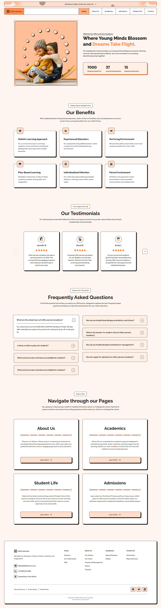
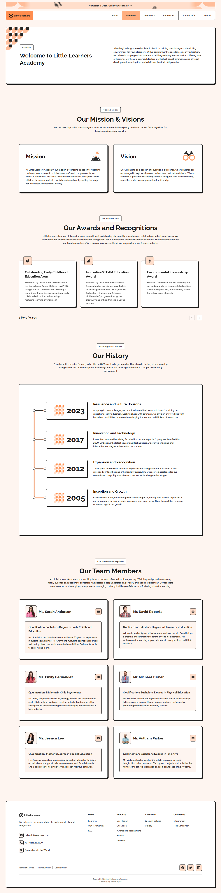
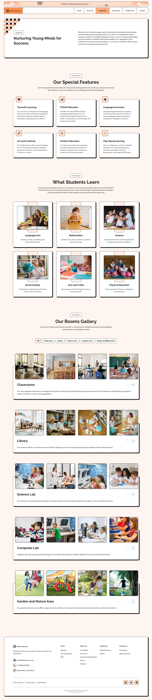
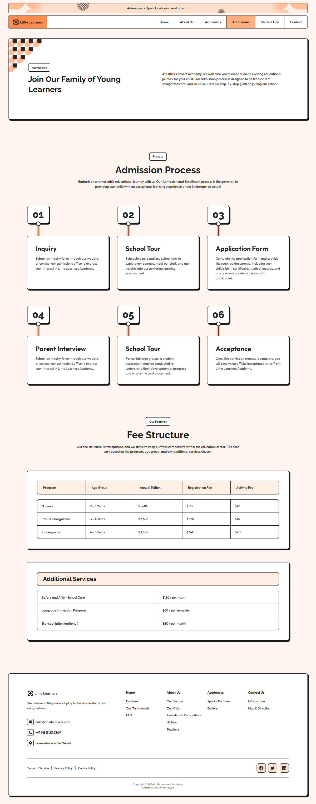
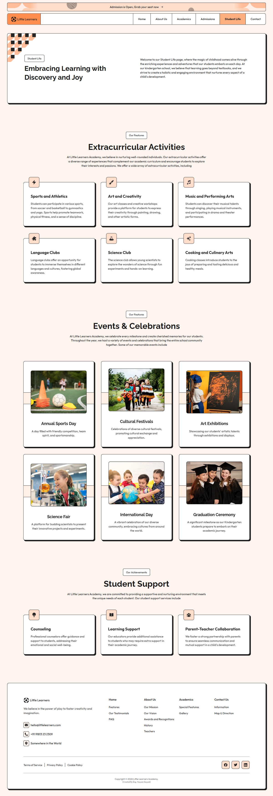
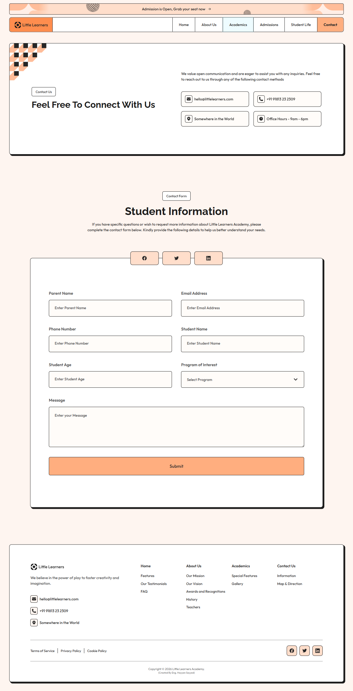

# 🎓 Little Learners Academy - Landing Page

A modern, responsive, and high-performance landing page for a Kindergarten school. Built with **React**, **TypeScript**, and **Vite**.

## 📸 Project Screenshots
### Home Page

## 🚀 Live Demo
[View Live Demo](https://hayyan-sayyed.github.io/academy-landing-page/)

---

## 🛠 Tech Stack
- **Framework:** React 18 (Functional Components & Hooks)
- **Language:** TypeScript (Strict Type Checking)
- **Routing:** React Router DOM (Single Page Application)
- **Styling:** Pure CSS3
- **Build Tool:** Vite
- **Animations:** Custom CSS Transitions & Framer-Motion Animations

---

## ✨ Key Features
- **Clean Architecture:** Component-based structure with clear separation of concerns.
- **Dynamic Content:** All data (Nav links, Gallery, Testimonials) is managed via centralized data files.
- **Custom Slider:** A lightweight, dependency-free image slider built from scratch.
- **Interactive Gallery:** Tab-based filtering system for different school sections.
- **Fully Responsive:** Optimized for Mobile, Tablet, and Desktop screens.

---
